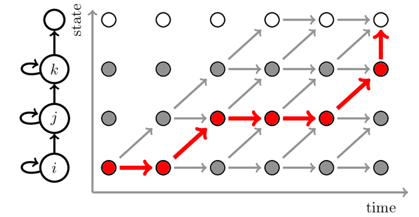

# Sản phẩm
Bài tập lớn nhóm 8 môn học xử lý tiếng nói

Ứng dụng trợ lý ảo với các chức năng hỗ trợ người dùng bằng giọng nói sử dụng Tkinter và OpenCV

# Cách cài đặt
1. Cài đặt các thư viện:

    _pip install -r requirements.txt_ 

    Vào https://www.lfd.uci.edu/~gohlke/pythonlibs/#pyaudio. Chọn và tải phiên bản đúng với phiên bản python đang chạy (python --version) và chạy 
    
    _pip install [đường dẫn đến file]_

    Ví dụ python 3.10

    _pip install lib/PyAudio-0.2.11-cp310-cp310-win_amd64.whl__

    
2. Chạy ứng dụng

    _python GUIASSISTANT.py_
# Phương pháp

- Sử dụng các hàm của thư viện speech_recognition

- Đối tượng recognizer của thư viện sẽ được khởi tạo. Nó được dùng để chương trình có thể nhận biết được khi nào thì giọng nói của người dùng sẽ được đưa vào xử lý qua thông số năng lượng của âm thanh. Âm thanh được đưa liên tục cho recognizer qua đối tượng Microphone của trương trình

Recognizer chia luồng âm thanh thành nhiều frame và cho vào một buffer để xử lý từng frame một. Bẳng việc sử dụng hàm rms của module audioop của Python năng lượng của từng frame sẽ được lấy. 
Khi mức năng lượng đó quá một ngưỡng nào đó thì cả luồng âm thanh sẽ được nhận. Ở đây nhóm đã đế khi năng lượng của âm thanh quá 4000 thì chương trình nhận giọng nói.

Sau thu âm giọng nói xong file âm thanh được gửi cho api của google để xử lý và nhóm sẽ lấy kết quả nhận được đó để tạo ra các chức năng của phần mềm. Sample rate của sẽ được đảm bảo hơn 8 kHz và kích thước hơn 16kb bởi chương trình trước khi gửi.

- Các thuật toán mà google dùng để nhận dạng giọng nói là:

PLP features

Viterbi search

Deep Neural Networks

discriminative training

WFST (weighted finite-state transducers) framework

# Các chức năng:

- Trò chuyện cơ bản

- Tìm kiếm bằng webScraping

- Chỉ đường bằng google map

- Dịch

- Tìm kiếm trên youtube

- Xem thời tiết

- Máy tính 

- Truyện cười

# Thành viên
Nguyễn Trung Hiếu 19021271

Mai Công Danh 19021233

Nguyễn Thế Hoàng 19021283

Lê Bá Gia Huy 

# Phân chia công việc
3 backend - 1 frontend

Frontend: Nguyễn Thế Hoàng

Backend: 

- Nguyễn Trung Hiếu

- Lê Bá Gia Huy

- Mai Công Danh
